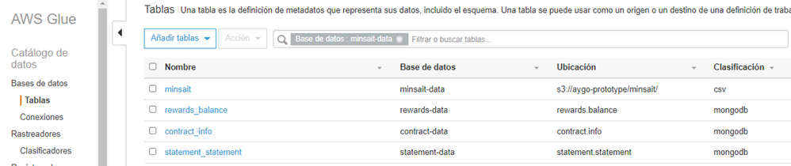
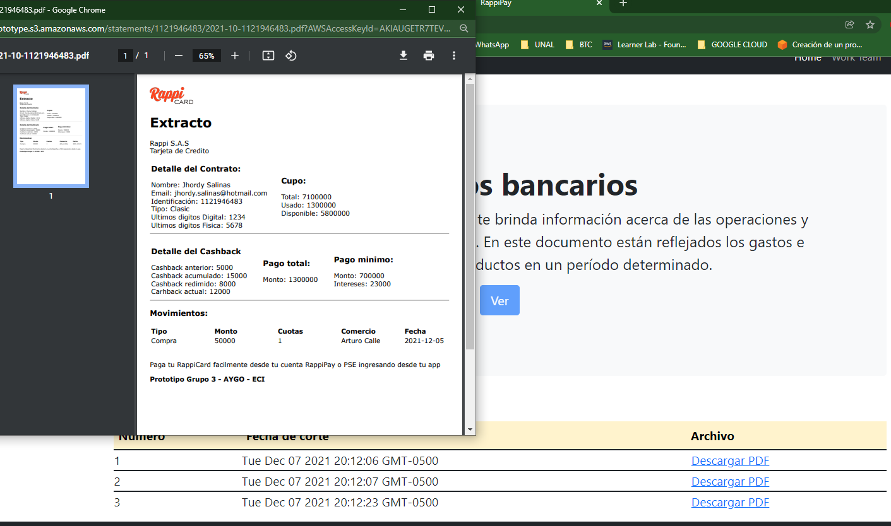

# Proyecto Demo: Generación de extractos Rappipay
Es la billetera virtual de Rappi en alianza con Davivienda, con la que puedes disfrutar la nueva forma de administrar y controlar tu dinero de manera segura, sin papeleos, 100% digital y todo desde una misma App📲. RappiPay vive dentro de la aplicación Rappi que está disponible en App Store y Google Play.

**APP Amplify:** https://main.d18r3h05m1zwek.amplifyapp.com/
## Problema
La generación de extractos para los diferentes productos financieros es tardada, se tarda casi una hora por extracto procesados en paralelo. Se necesitan 10 horas para generar 50 mil extractos.
### Cuando se da por solucionado
Cuando se logre generar 50 mil extractos por hora con cero errores. Esto representa una reducción del 80% en el tiempo de procesamiento respecto al proceso actual.
### Periodo de medición: 
Mensual para todos los países

## Dominio y linea destino de arquitectura
Para el proyecto se realizo la definicion del problema, el alcance y la identificacion base de arquitecturas de Rappipay. 
Las siguientes imagenes muestran las arquitecturas base definidas.
### Linea base: Conceptos de información
En la siguiente diagrama tenemos los conceptos de información relacionados al alcance del proyecto, estos conceptos son los requeridos para generar los extractos de los clientes.
Contienen informacion del contrato, rewards, detalles de movimientos, caschback e informacion adicional reqeurida.

### Linea base: Mapa de aplicaciones
En el siguiente diagrama tenemos la arquitectura de aplicaciones actual que soporta el proceso de generacion de extractos y en el cual tenemos los problemas mencionados.

### Linea destino: Mapa de aplicaciones 
En el siguiente diagrama tenemos la arquitectura de aplicaciones al que queremos llegar a implementar y tiene muchos de los servicios que se utilizaron en el prototipo.

## Arquitectura del prototipo

En la imagen anterior se muestra la arquitectura del prototipo, esta arquitectura esta diseñada para una solución en la nube y para este caso con el proveedor de Amazon.
En esta arquitectura se utilizan los isguientes servicios.

* **AWS Amplify:** Es un servicio que provee un conjunto de heraamientas creados específicamente para que los desarrolladores web y móviles de frontend puedan crear aplicaciones de pila completa en AWS de forma rápida y sencilla. 
  Se decide usar este servicio ya que es compatible con los leguajes, marcos y plataformas conocidos para el desarrollo web y android como JavaScript.
  
* **Amazon S3:** Amazon S3 es un servicio de almacenamiento de objetos que ofrece escalabilidad, disponibilidad de datos, seguridad y rendimiento. En este servicio de almacenamiento alojamos la informacion DATA MINSAIT generada por las interfaces de minsat y los extractos generados para cada cliente por contrato.
  
  
* **AWS Lambda:** AWS Lambda es un servicio informático sin servidor y basado en eventos que le permite ejecutar código sin necesidad de aprovisionar servidores. En el prototipo este servicio se implemento mediante Python 3.8 con las librerias de boto3, pymongo, Jija2, weasyprint y es la pieza principal que genera el extracto bancario (pdf) con cierto template y que solo se ejecutara cuando reciba toda la informacion requerida y que sea la fecha de corte.
  
* **DocumentDB:** Amazon DocumentDB es un servicio de base de datos escalable, de larga duración y completamente administrado para operar cargas de trabajo de MongoDB esenciales. 
  Este servicio se utiliza principalmente por la copatibilidad con MongoDB, se cargan la información lista para ser usada en la cosntrucción del extracto de los clientes y la informacion DATA BASICS generada por los diferentes Squads.
  
* **AWS Glue:** AWS Glue es un servicio de integración de datos sin servidores que facilita la detección, preparación y combinación de datos para análisis, machine learning y desarrollo de aplicaciones. En el servicio de AWS Glue alojamos el proceso de Extracción, Transformación y Carga de la información recibida por los diferentes squadas y por minsait, que compone la información template de DATA BASICS y DATA MINSAIT.
  El template de DATA BASIC y MINSATIN esta compuesto por imformación relacionada con el cliente como el contrato, rewards, pago de movimiento, detalle de los movimientos e ifo relacionada.
  
### Evidencias prototipo

